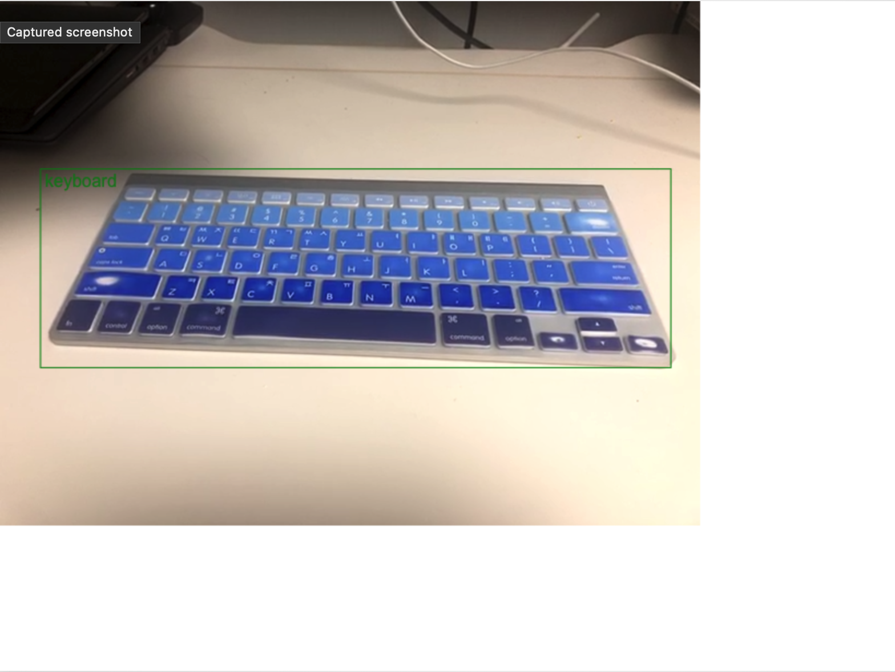

### tensoflow.js object detector

아래의 예제를 react.js 기반의 웹앱으로 구현한 것입니다  
처음에는 ml5.js를 사용했지만, tf.js를 사용하도록 구현을 바꾸었습니다.  
[DEMO](https://shoveller.github.io/object_detector/index.html)  
`https://github.com/ml5js/ml5-library/tree/main/examples/javascript/ObjectDetector/COCOSSD_webcam`  

